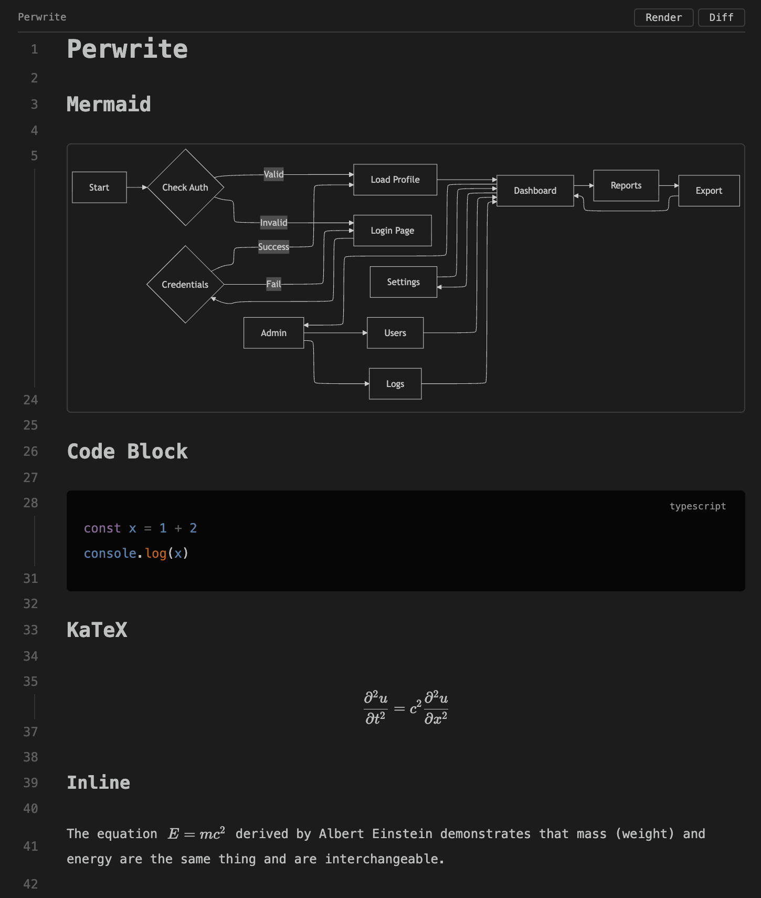
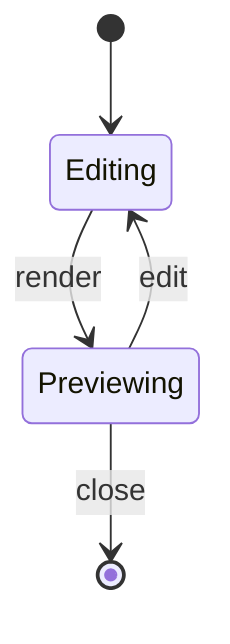
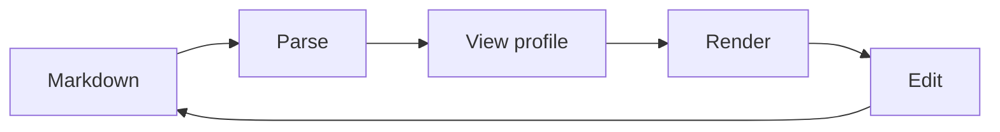

# Perwrite Markdown Showcase

This document brings together the Markdown structures that you can inspect in Perwrite. Use the toolbar to switch between `raw`, `rich`, and `render`, and compare the source, the styled source, and the rendered result.

## Basic Markdown

Perwrite lets you edit Markdown while viewing its rendered form in the same editor. This section combines **bold text**, *emphasis*, ~~strikethrough~~, and `inline code` in ordinary paragraphs.

It also includes a standard [link](https://code.visualstudio.com/), an internal [Japanese README](../README-ja.md), a wiki link `[[Perwrite]]`, and a wiki link with an alias `[[README-ja|Japanese README]]`.

The source includes a wiki embed, `![[perwrite-rendering.png]]`, as well.

## Headings and Images

### A Representative Image



The image uses a relative path from this Markdown document.

#### View Modes

- `raw`: Markdown source
- `rich`: styled source with its Markdown structure intact
- `render`: rendered content

##### Content Types

1. Ordinary Markdown text
2. Structured blocks
3. Rendered elements

###### Sixth-Level Heading

Perwrite supports six heading levels.

## Lists and Blockquotes

- A bullet-list item
  - A nested item
  - An item containing `code`
- An item containing an image or a link

1. The first step
2. The next step
3. The final step

- [ ] An unchecked task
- [x] A completed task

> A blockquote presents related text as a separate block.
>
> This example spans multiple lines.

---

## Tables and Math

| Structure | Example | Status |
| --- | --- | --- |
| Table | GFM table | **supported** |
| Math | $E = mc^2$ | `inline` |
| Link | [Perwrite](../README.md) | supported |

The block formula below demonstrates multi-line KaTeX rendering.

$$
\frac{\partial^2 u}{\partial t^2} = c^2 \frac{\partial^2 u}{\partial x^2}
$$

## Code

```typescript
interface DocumentSummary {
  readonly title: string
  readonly structures: readonly string[]
}

const summary: DocumentSummary = {
  title: 'Perwrite Markdown Showcase',
  structures: ['table', 'math', 'mermaid'],
}

console.log(summary)
```

## Mermaid Diagrams

State transition diagram:



Flowchart:



## Reviewing the Rendering

Open this document in VS Code or a compatible editor, then use the toolbar to switch between `raw`, `rich`, and `render`. Each mode shows how the Markdown source corresponds to the rendered content.
